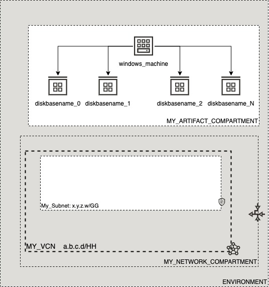

# OCI Cloud Bricks: iSCSI Disks (Windows)

[](https://img.shields.io/badge/license-UPL-green) [](https://sonarcloud.io/dashboard?id=oracle-devrel_terraform-oci-cloudbricks-windows-iscsi-disks)

## Introduction
The following brick enables the creation of several Disks to later be attached to a combinatory of Computes in Windows OS Flavor.

## Reference Architecture
The following is the reference architecture associated to this brick



### Prerequisites
- Pre-baked Artifact and Network Compartments

---

# Sample tfvars file

```shell
########## SAMPLE TFVAR FILE ##########
######################################## PROVIDER SPECIFIC VARIABLES ######################################
region           = "foo-region-1"
tenancy_ocid     = "ocid1.tenancy.oc1..abcdefg"
user_ocid        = "ocid1.user.oc1..aaaaaaabcdefg"
fingerprint      = "fo:oo:ba:ar:ba:ar"
private_key_path = "/absolute/path/to/api/key/your_api_key.pem"
######################################## PROVIDER SPECIFIC VARIABLES ######################################
######################################## DISK SPECIFIC VARIABLES ######################################
compute_availability_domain_list     = ["aBCD:RE-REGION-1-AD-1"]
disk_label_map                       = { "D" : "DATA", "E" : "STUFF" }
amount_of_disks                      = "2"
disk_size_in_gb                      = "50"
iscsi_disk_instance_compartment_name = "MY_ARTIFACT_COMPARTMENT"
volume_display_name                  = "diskbasename"
backup_policy_level                  = "bronze"

compute_display_name                 = "windows_machine"
windows_compute_id                   = "ocid1.instance.oc1.re-region-1.foobar"
os_password                          = "windows_machine_password"
windows_compute_private_ip           = "1.2.3.4"
######################################## DISK SPECIFIC VARIABLES ######################################
########## SAMPLE TFVAR FILE ##########
```

### Variable specific considerations
- Variable `compute_availability_domain_list` has to contain the exact AD where the windows compute is. This is because you can not attach a disk that it's on a different AD to that machine. Make sure that this is as instructed, if not code will fail to succeed. 

### Sample provider

The following is the base provider definition to be used with this module

```shell
terraform {
  required_version = ">= 0.13.5"
}
provider "oci" {
  region       = var.region
  tenancy_ocid = var.tenancy_ocid
  user_ocid        = var.user_ocid
  fingerprint      = var.fingerprint
  private_key_path = var.private_key_path
  disable_auto_retries = "true"
}

provider "oci" {
  alias        = "home"
  region       = data.oci_identity_region_subscriptions.home_region_subscriptions.region_subscriptions[0].region_name
  tenancy_ocid = var.tenancy_ocid  
  user_ocid        = var.user_ocid
  fingerprint      = var.fingerprint
  private_key_path = var.private_key_path
  disable_auto_retries = "true"
}
```

## Requirements

No requirements.

## Providers

| Name | Version |
|------|---------|
| <a name="provider_null"></a> [null](#provider\_null) | n/a |
| <a name="provider_oci"></a> [oci](#provider\_oci) | n/a |

## Modules

No modules.

## Resources

| Name | Type |
|------|------|
| [null_resource.init_and_format](https://registry.terraform.io/providers/hashicorp/null/latest/docs/resources/resource) | resource |
| [null_resource.init_disk_services](https://registry.terraform.io/providers/hashicorp/null/latest/docs/resources/resource) | resource |
| [null_resource.present_disk](https://registry.terraform.io/providers/hashicorp/null/latest/docs/resources/resource) | resource |
| [null_resource.set_execution_policy](https://registry.terraform.io/providers/hashicorp/null/latest/docs/resources/resource) | resource |
| [null_resource.wait_for_cloudinit](https://registry.terraform.io/providers/hashicorp/null/latest/docs/resources/resource) | resource |
| [oci_core_volume.ISCSIDisk](https://registry.terraform.io/providers/hashicorp/oci/latest/docs/resources/core_volume) | resource |
| [oci_core_volume_attachment.ISCSIDiskAttachment](https://registry.terraform.io/providers/hashicorp/oci/latest/docs/resources/core_volume_attachment) | resource |
| [oci_core_volume_backup_policy_assignment.backup_policy_assignment_ISCSI_Disk](https://registry.terraform.io/providers/hashicorp/oci/latest/docs/resources/core_volume_backup_policy_assignment) | resource |
| [oci_core_volume_backup_policies.BACKUPPOLICYISCSI](https://registry.terraform.io/providers/hashicorp/oci/latest/docs/data-sources/core_volume_backup_policies) | data source |
| [oci_identity_compartments.COMPARTMENTS](https://registry.terraform.io/providers/hashicorp/oci/latest/docs/data-sources/identity_compartments) | data source |

## Inputs

| Name | Description | Type | Default | Required |
|------|-------------|------|---------|:--------:|
| <a name="input_amount_of_disks"></a> [amount\_of\_disks](#input\_amount\_of\_disks) | Amount of equally sized disks | `any` | n/a | yes |
| <a name="input_attach_disks"></a> [attach\_disks](#input\_attach\_disks) | Atach disk to a Linux instance | `bool` | `true` | no |
| <a name="input_attachment_type"></a> [attachment\_type](#input\_attachment\_type) | Atacchment type can be iscsi or paravirtualized | `string` | `"iscsi"` | no |
| <a name="input_backup_policy_level"></a> [backup\_policy\_level](#input\_backup\_policy\_level) | Backup policy level for ISCSI disks | `any` | n/a | yes |
| <a name="input_compute_availability_domain_list"></a> [compute\_availability\_domain\_list](#input\_compute\_availability\_domain\_list) | Defines the availability domain list where OCI artifact will be created. This is a numeric value greater than 0 | `list(any)` | n/a | yes |
| <a name="input_compute_display_name"></a> [compute\_display\_name](#input\_compute\_display\_name) | Name of the compute where the disk will be attached to | `any` | n/a | yes |
| <a name="input_disk_label_map"></a> [disk\_label\_map](#input\_disk\_label\_map) | Mapping of Disk Letter plus it's mapping | `map(any)` | n/a | yes |
| <a name="input_disk_size_in_gb"></a> [disk\_size\_in\_gb](#input\_disk\_size\_in\_gb) | Size in GB for Product Disk | `any` | n/a | yes |
| <a name="input_filesystem_format"></a> [filesystem\_format](#input\_filesystem\_format) | Describes Filesystem format for the Disk | `string` | `"NTFS"` | no |
| <a name="input_fingerprint"></a> [fingerprint](#input\_fingerprint) | API Key Fingerprint for user\_ocid derived from public API Key imported in OCI User config | `any` | n/a | yes |
| <a name="input_format_disk_ps1"></a> [format\_disk\_ps1](#input\_format\_disk\_ps1) | Describes format\_disk.ps1 powershell script placeholder variable | `string` | `"format_disk.ps1"` | no |
| <a name="input_is_winrm_configured_for_image"></a> [is\_winrm\_configured\_for\_image](#input\_is\_winrm\_configured\_for\_image) | Defines if winrm is being used in this installation | `string` | `"true"` | no |
| <a name="input_is_winrm_configured_with_ssl"></a> [is\_winrm\_configured\_with\_ssl](#input\_is\_winrm\_configured\_with\_ssl) | Use the https 5986 port for winrm by default. If that fails with a http response error: 401 - invalid content type, the SSL may not be configured correctly | `string` | `"true"` | no |
| <a name="input_iscsi_disk_instance_compartment_name"></a> [iscsi\_disk\_instance\_compartment\_name](#input\_iscsi\_disk\_instance\_compartment\_name) | Defines the compartment name where the infrastructure will be created | `any` | n/a | yes |
| <a name="input_iswin2008"></a> [iswin2008](#input\_iswin2008) | Describes if the instance is Windows 2008 or not | `bool` | `false` | no |
| <a name="input_os_password"></a> [os\_password](#input\_os\_password) | Defines Windows opc password | `any` | n/a | yes |
| <a name="input_os_user"></a> [os\_user](#input\_os\_user) | Defines default admin user for instance | `string` | `"opc"` | no |
| <a name="input_partition_style"></a> [partition\_style](#input\_partition\_style) | Describes Partition Style for the Disk | `string` | `"MBR"` | no |
| <a name="input_private_key_path"></a> [private\_key\_path](#input\_private\_key\_path) | Private Key Absolute path location where terraform is executed | `any` | n/a | yes |
| <a name="input_region"></a> [region](#input\_region) | Target region where artifacts are going to be created | `any` | n/a | yes |
| <a name="input_setup_ps1"></a> [setup\_ps1](#input\_setup\_ps1) | Describes setup.ps1 powershell script placeholder variable | `string` | `"setup.ps1"` | no |
| <a name="input_ssh_private_is_path"></a> [ssh\_private\_is\_path](#input\_ssh\_private\_is\_path) | Determines if key is supposed to be on file or in text | `bool` | `true` | no |
| <a name="input_ssh_private_key"></a> [ssh\_private\_key](#input\_ssh\_private\_key) | Determines what is the private key to connect to machine | `any` | n/a | yes |
| <a name="input_tenancy_ocid"></a> [tenancy\_ocid](#input\_tenancy\_ocid) | OCID of tenancy | `any` | n/a | yes |
| <a name="input_user_ocid"></a> [user\_ocid](#input\_user\_ocid) | User OCID in tenancy. Currently hardcoded to user denny.alquinta@oracle.com | `any` | n/a | yes |
| <a name="input_userdata"></a> [userdata](#input\_userdata) | Describes userdata placeholder variable | `string` | `"userdata"` | no |
| <a name="input_volume_display_name"></a> [volume\_display\_name](#input\_volume\_display\_name) | Disk display name. | `any` | n/a | yes |
| <a name="input_vpus_per_gb"></a> [vpus\_per\_gb](#input\_vpus\_per\_gb) | n/a | `number` | `10` | no |
| <a name="input_windows_compute_id"></a> [windows\_compute\_id](#input\_windows\_compute\_id) | OCI Id for instance to attach the disk | `any` | `null` | no |
| <a name="input_windows_compute_private_ip"></a> [windows\_compute\_private\_ip](#input\_windows\_compute\_private\_ip) | Compute private IP to logon into machine | `any` | n/a | yes |

## Outputs

| Name | Description |
|------|-------------|
| <a name="output_core_volumens"></a> [core\_volumens](#output\_core\_volumens) | n/a |
| <a name="output_core_volumens_attachment"></a> [core\_volumens\_attachment](#output\_core\_volumens\_attachment) | n/a |
| <a name="output_volumen_ids"></a> [volumen\_ids](#output\_volumen\_ids) | n/a |


## Contributing
This project is open source.  Please submit your contributions by forking this repository and submitting a pull request!  Oracle appreciates any contributions that are made by the open source community.

## License
Copyright (c) 2021 Oracle and/or its affiliates.

Licensed under the Universal Permissive License (UPL), Version 1.0.

See [LICENSE](LICENSE) for more details.
